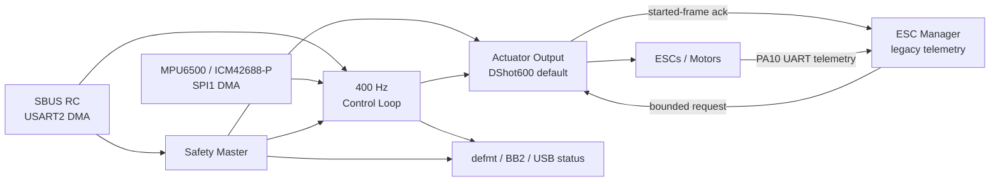
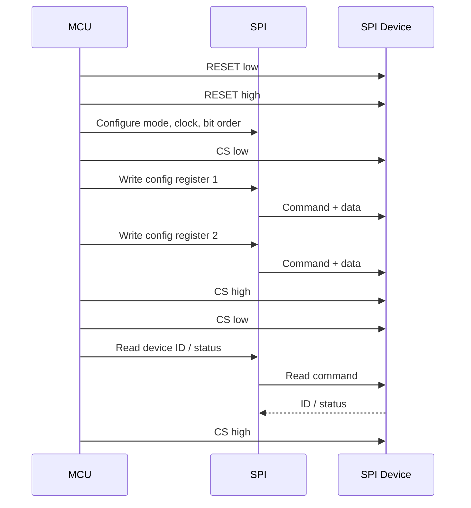

# FerroWasp

FerroWasp is a Rust/RTIC flight-control firmware prototype for multicopter UAVs.

FerroWasp is open source under the Apache License, Version 2.0. See
[Publication and Licence Status](./publication_status.md).

The project is currently in a rapid-prototyping phase. The immediate goal is
to learn quickly on real STM32F4-class hardware while keeping motor authority,
failure behavior, and test evidence explicit.

FerroWasp is not trying to clone PX4, ArduPilot, or Betaflight. The current
repository is about making one demonstrator honest, observable, and auditable.

## Current Prototype Shape

The repository contains reusable crates and three isolated RTIC application
graphs: the flight-tested FerroWasp FCU3 prototype, an arming-inhibited Foxeer
F405 V2 bring-up target, and a non-actuating NUCLEO-F401RE bring-up target.

Supported today:

- SBUS RC input over owned USART2 DMA buffers
- MPU6500 and ICM42688-P drivers with a bounded SPI1 DMA sample path
- FCU3 800 Hz IMU polling or Foxeer PC4/EXTI4 data-ready sampling with a
  400 Hz control update
- simple rate controller and quad mixer
- default four-lane DShot600 output on FCU3, with explicit RC PWM fallback
- safety-owned DShot output, command freshness checks, leases, and fault
  containment
- guarded arming that qualifies fresh idle eRPM from all four ESCs before the
  system becomes armed
- BLHeli legacy ESC telemetry on PA10 / USART1 RX in the default DShot image,
  parsed and associated by a low-priority ESC manager; inactive in the PWM
  fallback
- ADC DMA for temperature/voltage measurement
- DJI O4 MSPv1 OSD over UART4
- optional Foxeer USB CDC status and staged onboard flash log/config access
- `defmt`/RTT and compact BB2 control-loop logging

FCU3 has completed the recorded DShot bench gates and an operator-reported
controlled outdoor flight. The flight supported strong manoeuvres and did not
show the earlier yawing; pitch authority remains a tuning item. This is useful
prototype evidence, not an airworthiness or production-readiness claim.

See [Current Support](./current_support.md) for the detailed support matrix.

## Safety and Release Status

FerroWasp is experimental flight-control software. It is not certified, airworthy,
qualified, assured, validated, production-ready, or suitable for operational,
safety-critical use.

The current public release posture is:

- open source under Apache-2.0
- focused external contributions are welcome
- no operational, safety-critical, production, certification, or airworthiness claims

## Core Safety Boundary

The most important design rule is:

```text
Outer layers may request actuation, but only the safety/actuator-output path may command motor hardware.
```

In practical terms:

- RC input parses pilot intent.
- The safety master decides whether arming is allowed.
- The control loop computes requested motor outputs.
- The actuator-output task owns motor peripherals and applies the final gate.
- Telemetry, USB, configurators, experiments, and labs code must never directly command motors.

This boundary matters even during rapid prototyping. The process can stay lightweight, but motor authority should stay boring and explicit.

## Prototype Data Flow



## SPI Bring-Up Example


