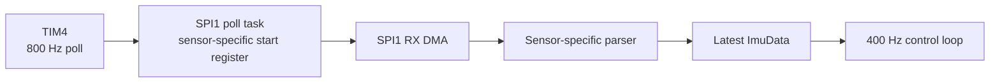

# IMU

FerroWasp currently supports MPU6500 and ICM42688-P devices over SPI1.

## Target Selection

| Board | IMU behavior |
|---|---|
| FerroWasp FCU3 | Fixed MPU6500 path, `WHO_AM_I=0x70` |
| Foxeer F405 V2 | Mode-3 probe selects MPU6500 `0x70` or ICM42688-P `0x47` |
| NUCLEO-F401RE | No attached IMU in the board contract |

An unsupported identity, failed probe, failed reset, or configuration
read-back failure leaves Foxeer sampling disabled. The heartbeat and unrelated
bring-up services continue, and flight arming remains inhibited.

## Driver Behavior

Both drivers are allocation-free modules in `ferrowasp-drivers` and use
`embedded-hal` 1.0 traits for blocking boot configuration.

MPU6500 support includes:

- device and signal-path reset
- SPI-only mode and `WHO_AM_I` validation
- 1 kHz gyro sampling with DLPF
- +/-2000 dps gyro and +/-8 g accelerometer ranges
- the 14-byte accel/temperature/gyro burst beginning at `0x3b`

ICM42688-P support includes:

- soft reset and reset-complete validation
- `WHO_AM_I=0x47` validation and bank-0 selection
- I2C disabled while big-endian sensor output is preserved
- register read-back before sensor power-up
- 1 kHz low-noise gyro and accelerometer output
- +/-2000 dps gyro and +/-16 g accelerometer ranges
- the required power transition and gyro startup delays
- the 14-byte temperature/accel/gyro burst beginning at `0x1d`
- temperature and physical-unit conversion helpers

SPI helpers always attempt to deassert chip select after a bus failure. Burst
decoders reject short, all-zero, and all-`0xff` frames.

## Runtime Flow

The two sensor layouts both fit the existing fixed 15-byte full-duplex DMA
transaction: one read-command byte plus 14 response bytes.

`SpiDmaOwner` exclusively owns SPI1, both DMA halves, chip select, timeout
recovery, and static receive buffers. The parser returns each receive buffer
after valid and invalid frames.

Foxeer currently polls the 1 kHz sensor output at 800 Hz. PC4/EXTI4
data-ready triggering is mapped by the BSP but remains deferred until target
timing can be measured.

## Axis And Rate Convention

Raw values remain in sensor-axis order. Each BSP supplies the axis indices and
signs used to produce measured roll, pitch, and yaw rates for the control loop.

FCU3's mapping and gyro bias behavior have bench evidence. Foxeer's fitted
sensor identity, package orientation, body-axis map, and signs must be checked
on the physical board before its arming inhibit can be removed.

The optional BB2 `gyro10` values use the same measured-rate convention passed
to the rate PID. Host viewers should display those roll, pitch, and yaw fields
directly.

See [RTT Debug Tools](./rtt_debug_tools.md) for the terminal logger and live
IMU viewer.

## Foxeer Bring-Up Checklist

1. Flash with motor power and props disconnected.
2. Record the supported identity log: decimal `112` for MPU6500 or `71` for
   ICM42688-P.
3. Confirm sequence numbers advance without SPI timeout or invalid-frame
   warnings.
4. Check stationary acceleration magnitude, gyro noise, and temperature.
5. Move one physical axis at a time and record raw signs.
6. Run a five-minute sample/heartbeat soak.
7. Measure PC4 data-ready timing before replacing timer polling.
8. Keep the board arming inhibit in place until orientation and motor waveform
   evidence is reviewed.

## Roadmap

- timestamp samples at the hardware data-ready edge
- validate ICM42688-P filter delay and sample timing on Foxeer
- add fault reporting for invalid or out-of-range samples
- add BMI088 support
- move more sensor-independent processing out of the RTIC app shell
